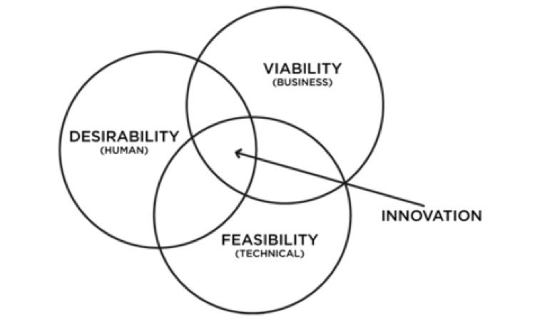
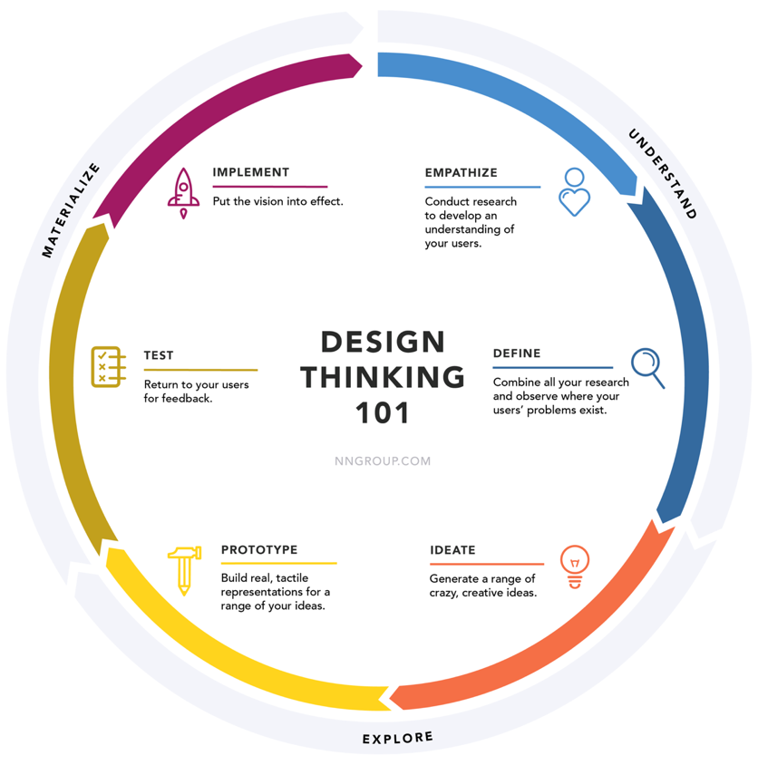
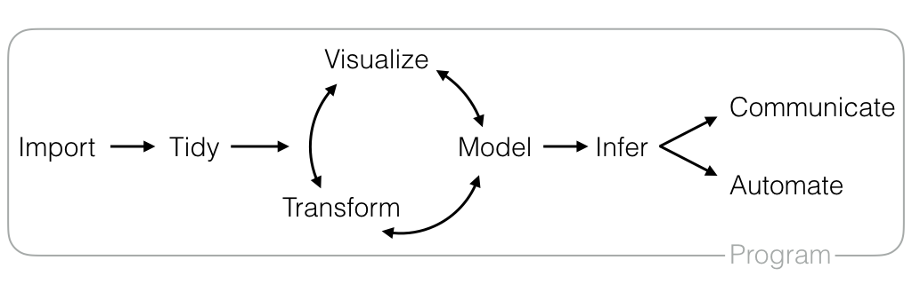
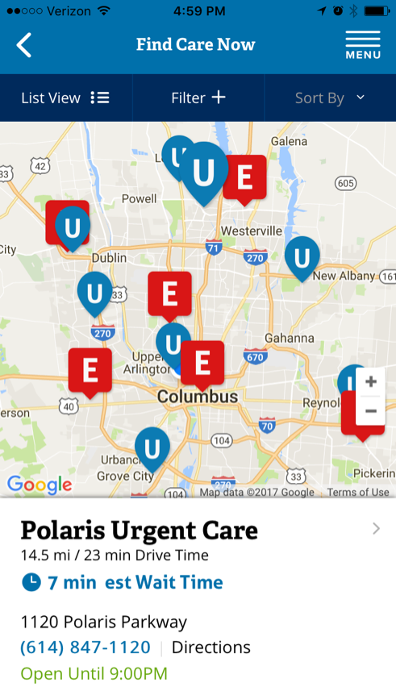

```{r setup, include=FALSE}
knitr::opts_chunk$set(echo = TRUE)
```

1. Introductions
2. Analytics as a Layer of Digital Transformations
3. Introduction to R 
4. Installation of RStudio
5. Demo of Programming in RStudio

---



---


---




---

>- Roles: Data scientists, software developers, infrastructure engineers, business analysts, subject matter experts
>- Backgrounds: Math/stats, social sciences, economics, computer science
>- Skills: Math/statistics, communications, domain expertise, “end-to-end”
>- Key Attributes: Curiosity, a desire to learn, a willingness to get hands dirty
>- Culture: Work in close proximity, exposure to variety of problems, safe to question, acceptable failure rate

---

>- Available data and an SME (can someone plug in a laptop and query the data?)
>- Business lead (provides guidance, removes roadblocks, serves as sounding board)
>- Quantifying the value to be created
>- Understanding the existing workflow (flowcharts are your friend)
>- Access to a real live user in the wild
>- Well-defined scope, in writing
>- Frequent communications with feedback (design sessions)


---



---




---

<iframe width="1200px" height="900px" src="http://fg2re.sellorm.com/"></iframe>s

---

<iframe width="1200px" height="900px" src="https://synikitin.github.io/analytics6600/"></iframe>


